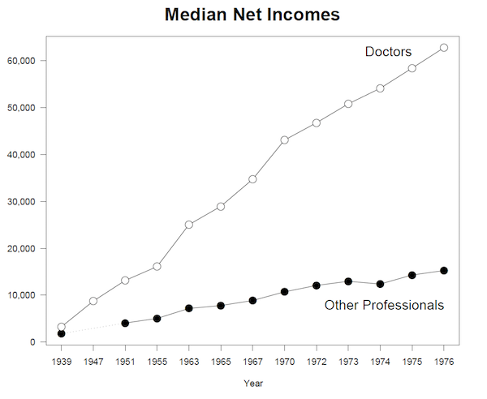
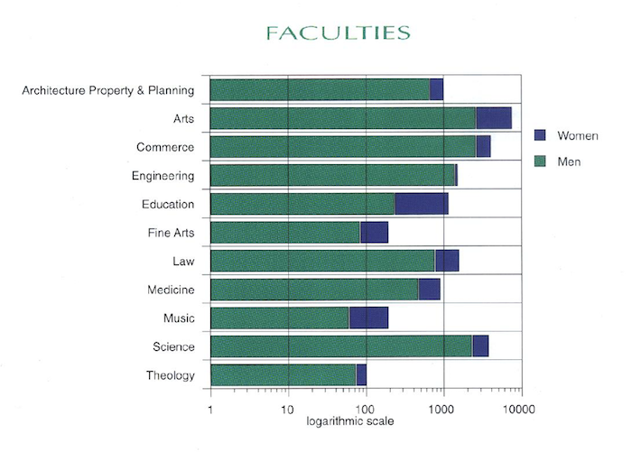

```{r echo=FALSE}
knitr::opts_chunk$set(prompt=FALSE, comment=NA, message=FALSE, tidy=TRUE, error=TRUE)
```

# Instructions
1. Save this file to `I:\STAT1003` and rename it `StudentID.Rmd`;
2. Download and save the file `STAT1003_Practice_Test1.RData` **along with any image files** into the same directory;
3. Carry out all of your work in this Rmarkdown file; 
4. <span style="color:#C40000">**Save your work frequently!**</span>
5. When you are finished, upload this Rmarkdown file and the resulting 'knitted' .docx file to the Assessments section from which you downloaded the files.
6. Total number of marks: **52**

```{r}
# Load the .RData file here

```

# Question 1 <span style="color:#C40000">Short Answer Questions</span>

(a) If someone who didn't know anything about data science were to ask you what it is, how would you describe it? What are some of the defining features of contemporary data science? (4 marks)

Answer: 

(b) Nate Silver, a well-known statistician who famously predicted every state that Obama carried in 2012, said in 2013 that "Statistics is a branch of science. Data scientist is slightly redundant in some way and people shouldn't berate the term statistician." Is he right or wrong? Why? (3 marks)

Answer: 

(c) The CSIRO website https://wefeel.csiro.au carries out semantic analysis on a large number of English-language tweets from around the world and then classifies them in categories such as 'joy', 'anger', etc. Is such an application useful for identifying periods when the population at large might be 'sad', thus allowing government agencies to intervene with, for example, public health campaigns? Why or why not? (3 marks)

Answer: 

(d) Briefly explain why the two figures below are misleading. The first one is meant to compare doctors' salaries with those of other professional, while the second one compares the proportion of men and women in different faculties at US universities. (Source: [Ross Ihaka](https://www.stat.auckland.ac.nz/~ihaka/120/)) (4 marks)


Answer:


Answer:


# Question 2 <span style="color:#C40000">Cherry Blossom Race</span>

The Cherry Blossom 10-Mile Run is a road race held in Washington, D.C. in April of each year. The name comes from the cherry trees that bloom around the date of the race. The object `Cherry` contains results from 1999 to 2008 and has the following variables:

* `name.yob`: a unique identifier for each runner composed of the runner's full name and year of birth.

* `age`: integer giving the runner's age in the race whose result is being reported.

* `gun`: the number of minutes elapsed from the starter's gun to the person crossing the finish line

* `net`: the number of minutes elapsed from the runner's crossing the start line to crossing the finish line.

* `sex`: the runner's sex

* `year`: the year of that race

* `previous`: integer specifying how many times previous to this race the runner had participated in the years 1999 to 2008.

* `nruns`: integer giving the total number of times that runner participated in the years from 1999 to 2008.

Because there are so many runners taking part in the race and they can't all line up at the starting line all at once, the `net` time will generally be shorter than the `gun` time. Make sure you understand what all the variables mean.

**Make sure that all plots are correctly labelled. A main title is not required, unless explicitly specified.**

(a) How many rows are in `Cherry`? What does each row represent? (2 marks)

Answer: 


(b) Which of the variables are categorical, and which are quantitative? (3 marks)

```{r}
# 

```

Answer: 

(c) Produce a barplot showing the number of runners in each year. You will also find the function `table` very useful. Which year had the most number of runners, and how many were there? (3 marks)

```{r}
#

```
Answer: 

(d) What is the age-range of runners over the entire time period? (1 mark)

```{r}
#

```

(e) Has the age-range of runners changed over the years? Use `tapply` to output the range of ages in each year the race was run. (3 marks)

```{r}
#

```

(f) How many unique runners ran in the race? (1 mark)

```{r}
#

```

(g) Produce a table showing the number of individuals who ran the race $2, 3, \ldots,$ number of times. (3 marks)

```{r}
#

```

(h) Produce a barplot of the summary in (g). (2 marks)

```{r}
#

```

(i) Create a separate dataset with only those individuals who have run the race in each year (i.e., for 10 years). (2 marks)

```{r}
#

```

(j) How many males and females ran the race during all these years? (2 marks)

```{r}
#

```


(k) Output the first 11 columns of this new dataset. You should notice that one of the columns has the symbol `NA` instead of a number. This represents a missing value - for whatever reason, the time was not recorded, or the person didn't finish the race. When calculating numerical summaries, missing values are a pain, but you can exclude them by including the argument `na.rm = TRUE` in a function.
    
    So, of the people who ran the race in all years, determine the fastest `net` time for males and females, and don't forget the additional argument! (3 marks)

```{r}
#

```

(l) Using the object you created in (i), create a dataset - it could be a matrix, for example - that contains only the `gun` times of these individuals in each of the 10 years. It would make more sense to have years down the rows, and individuals across the columns. Add column and row names. (4 marks)

```{r}
#

```

(m) Plot the gun times of these runners over time. This plot will need a main title. Comment briefly on any patterns you see in the plot. (4 marks)

```{r}
#

```

(n) Redraw the plot in (m), but this time colour the males and females in different colours. You will find it useful to create a separate vector containing the sex of each of the runners in this dataset. Add a legend. (5 marks)

```{r}
#

```

