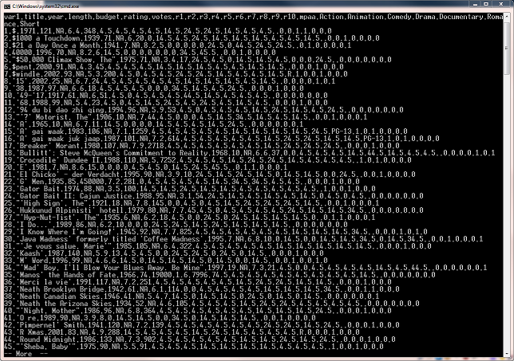

```{r echo=FALSE}
knitr::opts_chunk$set(prompt=FALSE, comment=NA, message=FALSE, tidy=TRUE)
```


# Wrangling and Exploring Data about Movies

The publicly-available portion of the [Internet Movie Database](http://www.imdb.com) is a popular website that contains virtually all the information you need to know about a movie: year of release, cast, crew, classification, and so on. Another website, [The Numbers](http://www.the-numbers.com), contains financial information for a relatively small subset of these films. Data from both these sites is available at the data-aggregation site [StatCrunch](http://www.statcrunch.com/5.0/shareddata.php?keywords=movies&Submit=Search&startlimit=0), and in this workshop, you will be putting two datasets together and carrying out some data-cleaning and exploratory data analysis and visualization.

Data that is available on, or scraped from, the web is encoded in many, many different formats and then has to be imported into R. One of the more convenient ones is a CSV - comma separated value - file. As [Baumer *et al.* (2017)][MDSR] write, "[I]t is a non-proprietary comma separated text format that is widely used for data exchange between different software packages. CSV files are easy to understand, but are not compressed, and therefore can take up more space on disk than other formats." The data files you'll be analyzing are CSV files (`IMDB.csv` and `MovieFinances.csv`). Download them from Blackboard into your `I:\STAT1003` folder.

The steps you'll be going through below are simply to 'get to know' the data as a prelude to analyzing it, or to building predictive models. The first step is to get the data into *R* and then to carry out some simple 'data wrangling' operations; the second is to prepare the data for exploratory analysis (EDA); and the third is to carry out the EDA. Note that there might be some iteration between the second and third steps! There is no one way of doing this: individuals will have their own preferences, and the steps here are only a guide.

**In what follows below, we'll be using Windows system commands. In OS X or different flavours of Unix, the system commands are different.**


1. Go to the [StatCrunch](http://www.statcrunch.com/5.0/shareddata.php?keywords=movies&Submit=Search&startlimit=0) website to find out a little bit more about the content of these files. In the list that you will see, `MovieFinances.csv` comes from the entry entitled "Movie Budgets and Box Office Earnings (Updated Fall 2016)", and `IMDB.csv` from the entry entitled "IMDB Movie Database". 

**Answer:** You should see something that looks like the following:


2. What is the size of these two files?

**Answer:** Of course, you could check this easily with Windows Explorer, or you could use the command prompt in Windows and then do a directory listing. Nevertheless, you can invoke operating system commands from within *R* as follows:
```{r}
# Windows

# shell("dir *.csv")

# Unix
system("ls -l *.csv")
```

3. Most operating systems will have utilities that will allow you to determine the number of lines in a file (and other information as well) without having to open the file in a program. Google how to do this at the Windows command prompt.

**Answer:** The command inside the `shell` function is what you'd type at the command prompt, but the chunk below will do the same thing within *R*. (It's a lot easier in Unix or OS X!) As you can see, both files - but especially `IMDB.csv` - contain a lot of records.

```{r results='asis'}
# Windows

# shell('find /C /V "" IMDB.csv')
# shell('find /C /V "" MovieFinances.csv')

# Unix
system("wc -l IMDB.csv") 
system("wc -l MovieFinances.csv")
```


4. Before importing a file into R, it's useful to know something about its structure. Again, use Google to find out how to view the contents of a text file at the command line.

**Answer:** The command to type out the contents of a file at the command line is simply `type filename`, so in this case, `type IMDB.csv` and `type MovieFinances.csv`. If you do so, however, you'll find that the entire file will scroll by very quickly. So, for example, use the command `type IMDB.csv | more` and you'll see something like this:



Note that the first line of the file is a 'header', that is, it contains the variable names.


5. Using the command `read.csv`, read in the data from these two files to create two data frames. For the purposes of this workshop, call them `IMDB` and `MovieFinances`. The values of some of the arguments will depend on the structure of the file that you saw in 3. above.

**Answer:** Have a look at the help file for the function `read.csv`. It takes lots of arguments, but in this instance, the `.csv` files are well-behaved, so the command is particulary simple; indeed, you don't even need the `header = TRUE` argument because it is the default.
```{r}
MovieFinances <- read.csv("MovieFinances.csv", header = TRUE)
```

```{r}
IMDB <- read.csv("IMDB.csv", header = TRUE)
```


6. After importing the `.csv` files into *R*, have a look at the variable names in both data frames, and then decide whether you need to modify some of them so that they are more compact or more meaningful.

**Answer:**You could look at the new objects in *RStudio* in the 'Environment' tab, but an alternative is to use the function `colnames`, which extracts and prints the column names.

```{r}
colnames(MovieFinances)
```

```{r}
colnames(IMDB)
```

Some of the variable names have changed after the `.csv` file has been imported, e.g., `Budget($M)` has become `Budget..M.`, which is clearly not a very useful name! To change them, we can assign new column names as follows:
```{r}
colnames(MovieFinances)[5] <- "Budget" # 5th element 
colnames(MovieFinances)[6] <- "DomesticGross"
colnames(MovieFinances)[7] <- "WorldwideGross"
```


7. Are there any variables that both datasets have in common? Which ones? Are there any superfluous columns/variables? If there are, remove them.

**Answer:**The variable `var1` in `IMDB` is superfluous - it is simply the observation number - and so we remove it as follows:
```{r}
IMDB <- IMDB[, -1] # i.e., remove the first column
```

It appears that the variables `Movie`, `Release.Year`, and `Budget` in `MovieFinances` are the same as `title`, `year`, and `budget` in `IMDB`. Note that we haven't yet checked to see whether their elements are identical for movies that appear in both datasets.


8. Use `head` to look at the first few rows of each data frame, or view them in the *RStudio* data viewer. Do you notice anything that might be unusual?

```{r}
head(MovieFinances)
```

```{r}
head(IMDB)
```

**Answer:** The variable **Budget:** in `IMDB` has a special symbol, `NA`, which denotes a missing value ('not available'). There may be other variables that have missing values too - we've only looked at the first six rows of two very large datasets!

9. Examine the structure of the variables in each data frame. What do you notice about the type of the variables `title` and `mpaa` in IMDB and `Movie` and `Month` in `MovieFinances`? What should we do about them?

**Answer:** Recall that the function `str` provides a summary of the data object and the variables it contains.

```{r}
str(IMDB)
```

```{r}
str(MovieFinances)
```

We can clearly see that the variables `title`, `mpaa`, `Movie`, and `Month` are factor variables, but perhaps `title` and `Movie` don't really need to be. That is a consequence of the way in which the data were imported using the function `read.csv`. We could convert `title` and `Movie` to character variables by using the function `as.character`:

```{r}
IMDB$title <- as.character(IMDB$title)
class(IMDB$title)
```

```{r}
MovieFinances$Movie <- as.character(MovieFinances$Movie)
class(MovieFinances$Movie)
```

Note that the variable `mpaa` is a factor variable which has multiple levels for the MPAA (Motion Picture Association of America) film classifications. However, one of the levels appears to be empty (`""`), so we need to do something about that. We could replace the empty values by `NA` (missing value), but it's probably better to create a new class name, `"Unknown"`. Here's how we can do that:

```{r}
levels(IMDB$mpaa) # the first element is what we want to replace
```

```{r}
levels(IMDB$mpaa)[1] <- "Unknown"
levels(IMDB$mpaa)
```


10. So it looks like we're going to do need to do some manipulation, but perhaps it's better to merge the data sets together because they'll only have some of the same common elements. Have a look at the help file for the function `merge`, and then merge the two datasets together. Call the result `AllData`. What variables should we merge on?

**Answer:** Make sure you understand the arguments to `merge`, especially if we're going to merge on more than one variable. Because the movie title and release year appear to be in common in these two datasets, let's merge on those. Note that we haven't actually checked whether the titles of the same movies in each dataset have been spelled exactly the same, nor whether the release years of those movies are the same. But that would be something we'd want to do in practice.

```{r}
AllData <- merge(IMDB, MovieFinances, by.x = c("title", "year"), by.y = c("Movie", "Release.Year"))
```

11. How large is the merged dataset? 

**Answer:** Using `dim` to determine the size of the dataset, we get
```{r}
dim(AllData)
```
So, it appears (though we'd need to check that) that only `r nrow(AllData)` movie titles (with the same release year) appear in both datasets. The variables in `AllData` are
```{r}
colnames(AllData)
```

As you might have noticed, the titles in the two datasets are not necessarily in the same format: for example, in `IMDB`, the 1973 movie *The Exorcist* is listed as `Exorcist, The`, but in `MovieFinances` it is listed as `The Exorcist`. So, bear in mind that `AllData` will not contain any films that begin with `The`!

12. Try out the function `summary` using the data frame as the argument. What kind of information does it produce? What unusual aspects do you notice?

The function `summary` gives you the 'five-number summary' along with the mean of each quantitative variable. For factor or character variable, it tabulates the number of each factor level or character string. Note that this is not always useful: for example, for the film-classification variables (`Action`, `Animation`, etc.), which are 0/1 variables, the five-number summary is not particularly useful. Furthermore, summary removes `NA`s from the data before calculating the five-number summary, so we no longer have any information about, for example, how many `NA`s there might be for each variable.

```{r}
summary(AllData)
```

13. Unfortunately, `summary` doesn't really tell us about missing values, but the function `describe` in the package `Hmisc` does. Install the package from the `Tools` menu, and then load the library `Hmisc` to be able to use `describe`. Scan the output of `describe` and try to understand what it's telling you.

```{r}
require(Hmisc)
describe(AllData)
```

As you can see, `describe` gives us a bit more detailed information than `summary`. See the help file for much more information. Again, not all of it is necessarily useful.

14. The function `describe` also has a nice feature: if you save the results of `describe` into an object, and then `plot` that object, you'll get a couple of plots that might be useful. What do those plots tell you about the distributions of the variables?

Perhaps more useful than the output of the function `describe` is the output of `plot(describe(dataframe))`. The visual display makes it easier to grasp the distributions of the categorical and quantitative variables. In addition, there is colour-coding to give us an indication of the number of missing values in each variable. Again, see the help file for much more information.

```{r}
DescripData <- describe(AllData)
plot(DescripData)
```


15. Note that there are two columns with budget information. what are the characteristics of those columns? Do they give the same information? What plot could you construct to determine whether they do?

The variables `Budget` and `budget` (case matters in *R*!) come from the two datasets that we merged in order to form `AllData`. As you can see from the summaries, `budget` gives us the actual dollar amounts, whereas `Budget` is in units of millions of dollars. Furthermore, one has more missing values than the other, and it's of interest to know if they give the same information. There are lots of ways of doing this, but one visual way is to plot the two variables on a scatterplot. If they give exactly the same information, all the points (those that aren't missing) should lie on a straight line.

```{r}
par(pty = "s") # square plot
plot(Budget ~ I(budget/10^6), data = AllData, xlab = "budget/1M") # I've divided budget by a million
abline(0, 1)
```
We can clearly see that although many of the films do have the same budget figures, many of them don't!

[MDSR]: "Baumer, B.S., Kaplan, D.T., and Horton, N.J. (2017) *Modern Data Science with R*. CRC Press: Boca Raton, FL."